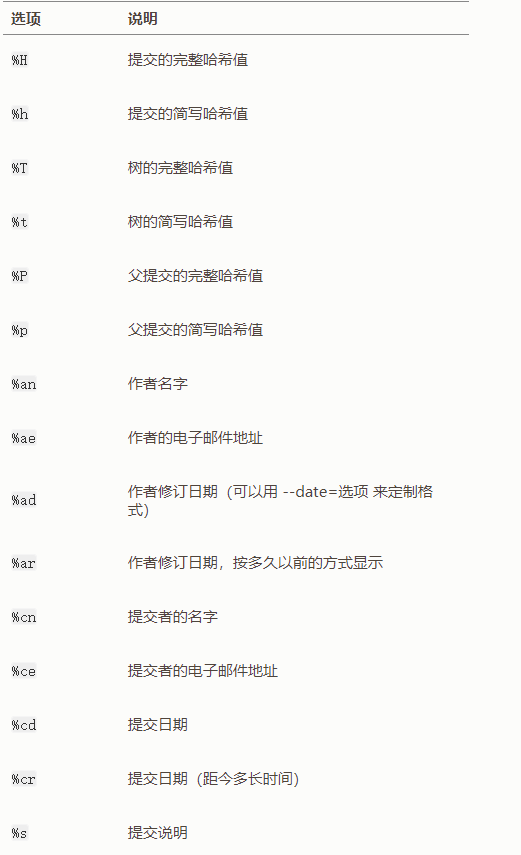
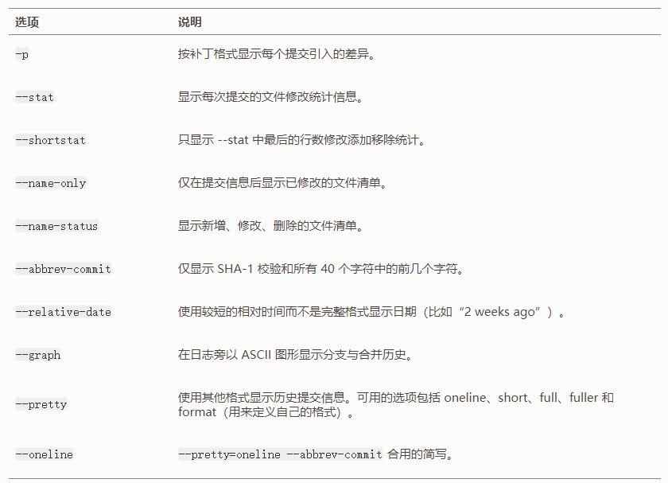
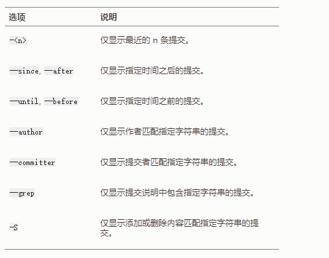

Git Pro Book
=====

## 1. Start ##

### 1.3 What is Git ###

**Git 保证完整性**

Git 中所有的数据在存储前都计算校验和，然后以校验和来引用。 这意味着不可能在 Git 不知情时更改任何文件内容或目录内容。 这个功能建构在 Git 底层，是构成 Git 哲学不可或缺的部分。

**三种状态**

已提交 committed 已修改 modified 已暂存 staged

- 已修改表示修改了文件，但还没保存到数据库中。
- 已暂存表示对一个已修改文件的当前版本做了标记，使之包含在下次提交的快照中。
- 已提交表示数据已经安全地保存在本地数据库中。

Git 项目拥有三个阶段：工作区，暂存区 和 Git目录


工作区是对项目的某个版本独立提取出来的内容。 这些从 Git 仓库的压缩数据库中提取出来的文件，放在磁盘上供你使用或修改。

暂存区是一个文件，保存了下次将要提交的文件列表信息，一般在 Git 仓库目录中。 按照 Git 的术语叫做“索引”，不过一般说法还是叫“暂存区”。

Git 仓库目录是 Git 用来保存项目的元数据和对象数据库的地方。 这是 Git 中最重要的部分，从其它计算机克隆仓库时，复制的就是这里的数据。

基本的 Git 工作流程如下：

1. 在工作区中修改文件。
2. 将你想要下次提交的更改选择性地暂存，这样只会将更改的部分添加到暂存区。
3. 提交更新，找到暂存区的文件，将快照永久性存储到 Git 目录。

如果 Git 目录中保存着特定版本的文件，就属于 **已提交** 状态。 如果文件已修改并放入暂存区，就属于 **已暂存** 状态。 如果自上次检出后，作了修改但还没有放到暂存区域，就是 **已修改** 状态。

### 1.6 Git 配置方式 ###

1. 系统级别的配置: `/etc/gitconfig` git 选项是 --system
2. 用户级别的配置: `~/.gitconfig` 只对当前用户有效 你可以传递 `--global` 选项让 Git 读写此文件，这会对你系统上 **所有** 的仓库生效。
3. 当前仓库级别的配置 `.git/config` 只对当前仓库有效。

你可以通过以下命令查看所有的配置以及它们所在的文件：

```console
$ git config --list --show-origin
```

**用户信息配置**

```console
$ git config --global user.name "John Doe"
$ git config --global user.email johndoe@example.com
```

如果使用了 `--global` 选项，那么该命令只需要运行一次，因为之后无论你在该系统上做任何事情， Git 都会使用那些信息。 当你想针对特定项目使用不同的用户名称与邮件地址时，可以在那个项目目录下运行没有 `--global` 选项的命令来配置。

**配置文本编辑器**

```console
$ git config --global core.editor emacs
```

**显示所有配置信息**

```console
C:\Users\Liberty>git config -l
diff.astextplain.textconv=astextplain
filter.lfs.clean=git-lfs clean -- %f
filter.lfs.smudge=git-lfs smudge -- %f
filter.lfs.process=git-lfs filter-process
filter.lfs.required=true
http.sslbackend=openssl
http.sslcainfo=d:/Program Files/Git/mingw64/ssl/certs/ca-bundle.crt
core.autocrlf=false
core.fscache=true
core.symlinks=false
pull.rebase=false
credential.helper=manager
```

你可以通过输入 `git config <key>`： 来检查 Git 的某一项配置

```console
$ git config user.name
John Doe
```

此时，你可以查询 Git 中该变量的 **原始** 值，它会告诉你哪一个配置文件最后设置了该值：

```console
$ git config --show-origin rerere.autoUpdate
file:/home/johndoe/.gitconfig	false
```

## 2. Git Base ##

### 2.1 获取Git仓库 ###

通常有两种获取 Git 项目仓库的方式：

1. 将尚未进行版本控制的本地目录转换为 Git 仓库；
2. 从其它服务器克隆 一个已存在的 Git 仓库。

**clone 现有的仓库**

如果你想在克隆远程仓库的时候，自定义本地仓库的名字，你可以通过额外的参数指定新的目录名：

```console
$ git clone https://github.com/libgit2/libgit2 mylibgit
```

### 2.2 记录更新 ###

请记住，你工作目录下的每一个文件都不外乎这两种状态：**已跟踪** 或 **未跟踪** 。


**检查当前文件状态**

```console
$ git status
On branch master
Your branch is up-to-date with 'origin/master'.
nothing to commit, working directory clean
```

如果之前并不存在这个文件，使用 git status 命令，你将看到一个新的未跟踪文件：

```console
$ git status
On branch master

No commits yet

Untracked files:
  (use "git add <file>..." to include in what will be committed)
        README.md
```

只要在 `Changes to be committed` 这行下面的，就说明是已暂存状态。

```console
$ git status
On branch master
Changes to be committed:
  (use "git restore --staged <file>..." to unstage)
        new file:   demo03.txt

Changes not staged for commit:
  (use "git add <file>..." to update what will be committed)
  (use "git restore <file>..." to discard changes in working directory)
        modified:   demo_01.txt
```

 出现在 `Changes not staged for commit` 这行下面，说明已跟踪文件的内容发生了变化，但还没有放到暂存区。将这个命令理解为“精确地将内容添加到下一次提交中”

**状态简览**

```console
$ git status -s
A  demo03.txt
M  demo_01.txt
```

**忽略文件**

在这种情况下，我们可以创建一个名为 `.gitignore` 的文件，列出要忽略的文件的模式

**查看已暂存和未暂存的修改**

`git diff` 命令比较的是工作目录中当前文件和暂存区域快照之间的差异。 也就是修改之后还没有暂存起来的变化内容。

```console
$ git diff
diff --git a/demo03.txt b/demo03.txt
index e69de29..6d34f32 100644
--- a/demo03.txt
+++ b/demo03.txt
@@ -0,0 +1,2 @@
+
+xxxxxxxxxxxxxxxxxxxxx
```

若要查看已暂存的将要添加到下次提交里的内容，可以用 `git diff --staged` 命令。 这条命令将比对已暂存文件与最后一次提交的文件差异：

```console
$ git diff --staged
diff --git a/demo_01.txt b/demo_01.txt
index b5b5cd2..1acd41d 100644
--- a/demo_01.txt
+++ b/demo_01.txt
@@ -1,3 +1,5 @@
 write a new line

 xxxxxxxxxxxxxxxxxxxxxxx
+
+yyyyyyyyyyyyyyyyyyyyyyyyyyyyyyyyyyyyy
```

```console
Liberty@LAPTOP-P85CKKBA MINGW64 ~/Downloads/packages/git-demo-package (master)
$ git status
On branch master
Changes to be committed:
  (use "git restore --staged <file>..." to unstage)
        modified:   demo03.txt

Changes not staged for commit:
  (use "git add <file>..." to update what will be committed)
  (use "git restore <file>..." to discard changes in working directory)
        modified:   demo03.txt


Liberty@LAPTOP-P85CKKBA MINGW64 ~/Downloads/packages/git-demo-package (master)
$ git diff
diff --git a/demo03.txt b/demo03.txt
index 0f67f12..5bdfd42 100644
--- a/demo03.txt
+++ b/demo03.txt
@@ -2,3 +2,6 @@
 xxxxxxxxxxxxxxxxxxxxx

 vvvvvvvvvvvvvvvvvvvvvvvvv
+
+
+ttttttttttttttttttttttttttttt

Liberty@LAPTOP-P85CKKBA MINGW64 ~/Downloads/packages/git-demo-package (master)
$ git diff --cached
diff --git a/demo03.txt b/demo03.txt
index 6d34f32..0f67f12 100644
--- a/demo03.txt
+++ b/demo03.txt
@@ -1,2 +1,4 @@

 xxxxxxxxxxxxxxxxxxxxx
+
+vvvvvvvvvvvvvvvvvvvvvvvvv

```

**提交更新**

请记住，提交时记录的是放在暂存区域的快照。 任何还未暂存文件的仍然保持已修改状态，可以在下次提交时纳入版本管理。

**移除文件**

要从Git中移除文件，必须要从已跟踪文件清单中移除（确切地说，是从暂存区域移除），然后提交。 可以用 `git rm` 命令完成此项工作，并连带从工作目录中删除指定的文件。

如果要删除之前修改过或已经放到暂存区的文件，则必须使用强制删除选项 `-f`

我们想把文件从 Git 仓库中删除（亦即从暂存区域移除），但仍然希望保留在当前工作目录中。 换句话说，你想让文件保留在磁盘，但是并不想让 Git 继续跟踪。`git rm --cached README`

**移动文件**

### 2.3 查看提交历史 ###

**查看提交历史**

`git log`

1, 显示每次提交所引入的差异（按 **补丁** 的格式输出）`git log -p -2`  `--patch ` `-2 `： 表示最近多少次的提交记录

```console
$ git log --patch -2
commit ca82a6dff817ec66f44342007202690a93763949 (HEAD -> master, origin/master, origin/HEAD)
Author: Scott Chacon <schacon@gmail.com>
Date:   Mon Mar 17 21:52:11 2008 -0700

    changed the verison number

diff --git a/Rakefile b/Rakefile
index a874b73..8f94139 100644
--- a/Rakefile
+++ b/Rakefile
@@ -5,7 +5,7 @@ require 'rake/gempackagetask'
 spec = Gem::Specification.new do |s|
     s.platform  =   Gem::Platform::RUBY
     s.name      =   "simplegit"
-    s.version   =   "0.1.0"
+    s.version   =   "0.1.1"
     s.author    =   "Scott Chacon"
     s.email     =   "schacon@gmail.com"
     s.summary   =   "A simple gem for using Git in Ruby code."

commit 085bb3bcb608e1e8451d4b2432f8ecbe6306e7e7
Author: Scott Chacon <schacon@gmail.com>
Date:   Sat Mar 15 16:40:33 2008 -0700

    removed unnecessary test code

diff --git a/lib/simplegit.rb b/lib/simplegit.rb
index a0a60ae..47c6340 100644
--- a/lib/simplegit.rb
+++ b/lib/simplegit.rb
@@ -18,8 +18,3 @@ class SimpleGit
     end

 end
-
-if $0 == __FILE__
-  git = SimpleGit.new
-  puts git.show
-end
```

2, 查看每次提交的简略统计信息, `--stat`

```console
$ git log --stat
commit ca82a6dff817ec66f44342007202690a93763949 (HEAD -> master, origin/master, origin/HEAD)
Author: Scott Chacon <schacon@gmail.com>
Date:   Mon Mar 17 21:52:11 2008 -0700

    changed the verison number

 Rakefile | 2 +-
 1 file changed, 1 insertion(+), 1 deletion(-)

commit 085bb3bcb608e1e8451d4b2432f8ecbe6306e7e7
Author: Scott Chacon <schacon@gmail.com>
Date:   Sat Mar 15 16:40:33 2008 -0700

    removed unnecessary test code

 lib/simplegit.rb | 5 -----
 1 file changed, 5 deletions(-)

commit a11bef06a3f659402fe7563abf99ad00de2209e6
Author: Scott Chacon <schacon@gmail.com>
Date:   Sat Mar 15 10:31:28 2008 -0700

    first commit

 README           |  6 ++++++
 Rakefile         | 23 +++++++++++++++++++++++
 lib/simplegit.rb | 25 +++++++++++++++++++++++++
 3 files changed, 54 insertions(+)
```

3, 提供不同于默认格式的显示方式: `--pretty`

```console
$ git log --pretty=oneline
ca82a6dff817ec66f44342007202690a93763949 (HEAD -> master, origin/master, origin/HEAD) changed the verison number
085bb3bcb608e1e8451d4b2432f8ecbe6306e7e7 removed unnecessary test code
a11bef06a3f659402fe7563abf99ad00de2209e6 first commit
```

4, 定制记录的显示格式： `--pretty=format`

```console
$ git log --pretty=format:"%h - %an, %ar : %s"
ca82a6d - Scott Chacon, 13 years ago : changed the verison number
085bb3b - Scott Chacon, 13 years ago : removed unnecessary test code
a11bef0 - Scott Chacon, 13 years ago : first commit
```



作者指的是实际作出修改的人，提交者指的是最后将此工作成果提交到仓库的人。

4, `--graph` 展示分支，合并历史

```console
$ git log --pretty=format:"%h %s" --graph
* ca82a6d changed the verison number
* 085bb3b removed unnecessary test code
* a11bef0 first commit
```

**GIT LOG 的常用选项**



**限制输出长度**

1， `--since` `--until` 按照时间限制。

2， `--author` 指定提交的作者

3，`--grep` 搜索提交说明中的关键字

4，`-S` 显示添加或者删除该字符串代码的提交。

5，`--no-merges` 不显示合并的提交历史



### 2.4 撤销更改 ###

1，使用 `--amend` 重新提交

`git -commit --amend` 此命令会将暂存区的文件提交。自上次提交以来你还未做任何修改， 那么快照会保持不变，而你所修改的只是提交信息。

```console
$ git commit -m 'initial commit'
$ git add forgotten_file
$ git commit --amend
```

最终你只会有一个提交——第二次提交将代替第一次提交的结果。

**取消暂存的文件**

`git reset HEAD demo01.txt`

```console
$ git status
On branch master
Changes to be committed:
  (use "git restore --staged <file>..." to unstage)
        modified:   demo01.txt
        modified:   demo03.txt

Liberty@LAPTOP-P85CKKBA MINGW64 ~/Downloads/packages/git-demo-package (master)
$ git reset HEAD demo01.txt
Unstaged changes after reset:
M       demo01.txt

Liberty@LAPTOP-P85CKKBA MINGW64 ~/Downloads/packages/git-demo-package (master)
$ git status
On branch master
Changes to be committed:
  (use "git restore --staged <file>..." to unstage)
        modified:   demo03.txt

Changes not staged for commit:
  (use "git add <file>..." to update what will be committed)
  (use "git restore <file>..." to discard changes in working directory)
        modified:   demo01.txt
```

**撤销对文件的修改**

撤销对未提交到暂存区更改的文件：`git checkout  -- <filename>`

### 2.5 远程仓库的使用 ###

**1. 查看远程仓库**

`git remote`

`-v` 选项显示 URL：

```console
$ git remote -v
origin  https://github.com/schacon/ticgit (fetch)
origin  https://github.com/schacon/ticgit (push)
```

**2. 添加远程仓库**

`git remote add  <shortname> <url>`

```console
$ git remote
origin
$ git remote add pb https://github.com/paulboone/ticgit
$ git remote -v
origin	https://github.com/schacon/ticgit (fetch)
origin	https://github.com/schacon/ticgit (push)
pb	https://github.com/paulboone/ticgit (fetch)
pb	https://github.com/paulboone/ticgit (push)
```

拉取指定仓库的信息： `git fetch <shortname>`  执行完成后，你将会拥有那个远程仓库中所有分支的引用，可以随时合并或查看。

必须注意 `git fetch` 命令只会将数据下载到你的本地仓库,它并不会自动合并或修改你当前的工作。 当准备好时你必须手动将其合并入你的工作。

你的当前分支设置了跟踪远程分支（阅读下一节和 [Git 分支](https://git-scm.com/book/zh/v2/ch00/ch03-git-branching) 了解更多信息）， 那么可以用 `git pull` 命令来自动抓取后合并该远程分支到当前分支。 

默认情况 git clone 命令会自动设置本地 master 分支跟踪克隆的远程的master分支。运行 `git pull` 通常会从最初克隆的服务器上抓取数据并自动尝试合并到当前所在的分支。

**推送到远程仓库**

`git push <remote> <branch>`

**查看远程仓库**

```console
$ git remote show origin
* remote origin
  Fetch URL: https://github.com/schacon/ticgit
  Push  URL: https://github.com/schacon/ticgit
  HEAD branch: master
  Remote branches:
    master tracked
    ticgit tracked
  Local branch configured for 'git pull':
    master merges with remote master
  Local ref configured for 'git push':
    master pushes to master (up to date)
```

**远程仓库的重命名与移除**

`git remote rename`

`git remote remove <shortname>`

### 2.6 标签 ###

**1. 列出标签**

`git tag [--list]`

```console
$ git tag -l "v1.8.5*"
v1.8.5
v1.8.5-rc0
v1.8.5-rc1
v1.8.5-rc2
v1.8.5-rc3
v1.8.5.1
v1.8.5.2
v1.8.5.3
v1.8.5.4
v1.8.5.5
```

**2. 创建标签**

Git 支持两种标签：轻量标签（lightweight）与附注标签（annotated）。

- 附注标签: `git tag -a v1.4 -m "my version 1.4"`

- 轻量标签：`git tag v1.4-w`

- 后期打标签: `git tag -a v1.2 -m "message" sha1`

**3. 共享标签**

`git push origin <tagname>`

`git push origin --tags`

**4. 删除标签**

删除本地标签： `git tag -d <tagname>`

上述命令并不会从任何远程仓库移除标签: `git push <remote> :refs/tags/<tagname>`

第二种删除远程标签的方式： `git push origin --delelte <tagname>`

**5. 检出标签**

### 2.7 Git 别名 ###

## 3. 分支 ##

### 3.1 分支简介 ###

首次提交产生的提交对象没有父对象，普通提交操作产生的提交对象有一个父对象， 而由多个分支合并产生的提交对象有多个父对象.

Git 会先计算每一个子目录（本例中只有项目根目录）的校验和， 然后在 Git 仓库中将这些校验和保存为树对象。随后，Git 便会创建一个提交对象， 它除了包含上面提到的那些信息外，还包含指向这个树对象（项目根目录）的指针。

第一次提交时：


以后的提交：


Git的分支在本质上仅是提交对象的可变指针。`master` 分支会在每次提交时自动向前移动。


**1，创建分支**

`git branch <branch_name>` , 创建分支后会在提交对象上创建一个指针。


git 通过 `HEAD` 指针指向当前的所在的本地分支。


使用 `git log --oneline --decorate` 查看各个分支当前所指的对象。

