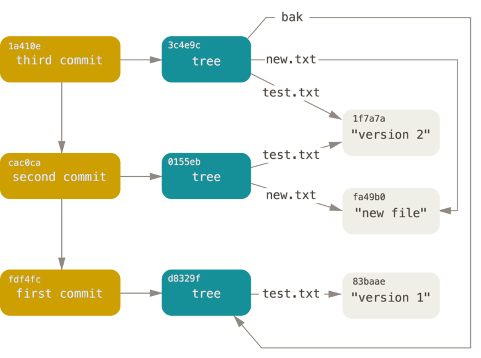

Git Pro Book
=====

## 1. Start ##

### 1.3 What is Git ###

**Git 保证完整性**

Git 中所有的数据在存储前都计算校验和，然后以校验和来引用。 这意味着不可能在 Git 不知情时更改任何文件内容或目录内容。 这个功能建构在 Git 底层，是构成 Git 哲学不可或缺的部分。

**三种状态**

已提交 committed 已修改 modified 已暂存 staged

- 已修改表示修改了文件，但还没保存到数据库中。
- 已暂存表示对一个已修改文件的当前版本做了标记，使之包含在下次提交的快照中。
- 已提交表示数据已经安全地保存在本地数据库中。

Git 项目拥有三个阶段：工作区，暂存区 和 Git目录


工作区是对项目的某个版本独立提取出来的内容。 这些从 Git 仓库的压缩数据库中提取出来的文件，放在磁盘上供你使用或修改。

暂存区是一个文件，保存了下次将要提交的文件列表信息，一般在 Git 仓库目录中。 按照 Git 的术语叫做“索引”，不过一般说法还是叫“暂存区”。

Git 仓库目录是 Git 用来保存项目的元数据和对象数据库的地方。 这是 Git 中最重要的部分，从其它计算机克隆仓库时，复制的就是这里的数据。

基本的 Git 工作流程如下：

1. 在工作区中修改文件。
2. 将你想要下次提交的更改选择性地暂存，这样只会将更改的部分添加到暂存区。
3. 提交更新，找到暂存区的文件，将快照永久性存储到 Git 目录。

如果 Git 目录中保存着特定版本的文件，就属于 **已提交** 状态。 如果文件已修改并放入暂存区，就属于 **已暂存** 状态。 如果自上次检出后，作了修改但还没有放到暂存区域，就是 **已修改** 状态。

### 1.6 Git 配置方式 ###

1. 系统级别的配置: `/etc/gitconfig` git 选项是 --system
2. 用户级别的配置: `~/.gitconfig` 只对当前用户有效 你可以传递 `--global` 选项让 Git 读写此文件，这会对你系统上 **所有** 的仓库生效。
3. 当前仓库级别的配置 `.git/config` 只对当前仓库有效。

你可以通过以下命令查看所有的配置以及它们所在的文件：

```console
$ git config --list --show-origin
```

**用户信息配置**

```console
$ git config --global user.name "John Doe"
$ git config --global user.email johndoe@example.com
```

如果使用了 `--global` 选项，那么该命令只需要运行一次，因为之后无论你在该系统上做任何事情， Git 都会使用那些信息。 当你想针对特定项目使用不同的用户名称与邮件地址时，可以在那个项目目录下运行没有 `--global` 选项的命令来配置。

**配置文本编辑器**

```console
$ git config --global core.editor emacs
```

**显示所有配置信息**

```console
C:\Users\Liberty>git config -l
diff.astextplain.textconv=astextplain
filter.lfs.clean=git-lfs clean -- %f
filter.lfs.smudge=git-lfs smudge -- %f
filter.lfs.process=git-lfs filter-process
filter.lfs.required=true
http.sslbackend=openssl
http.sslcainfo=d:/Program Files/Git/mingw64/ssl/certs/ca-bundle.crt
core.autocrlf=false
core.fscache=true
core.symlinks=false
pull.rebase=false
credential.helper=manager
```

你可以通过输入 `git config <key>`： 来检查 Git 的某一项配置

```console
$ git config user.name
John Doe
```

此时，你可以查询 Git 中该变量的 **原始** 值，它会告诉你哪一个配置文件最后设置了该值：

```console
$ git config --show-origin rerere.autoUpdate
file:/home/johndoe/.gitconfig	false
```

## 2. Git Base ##

### 2.1 获取Git仓库 ###

通常有两种获取 Git 项目仓库的方式：

1. 将尚未进行版本控制的本地目录转换为 Git 仓库；
2. 从其它服务器克隆 一个已存在的 Git 仓库。

**clone 现有的仓库**

如果你想在克隆远程仓库的时候，自定义本地仓库的名字，你可以通过额外的参数指定新的目录名：

```console
$ git clone https://github.com/libgit2/libgit2 mylibgit
```

### 2.2 记录更新 ###

请记住，你工作目录下的每一个文件都不外乎这两种状态：**已跟踪** 或 **未跟踪** 。


**检查当前文件状态**

```console
$ git status
On branch master
Your branch is up-to-date with 'origin/master'.
nothing to commit, working directory clean
```

如果之前并不存在这个文件，使用 git status 命令，你将看到一个新的未跟踪文件：

```console
$ git status
On branch master

No commits yet

Untracked files:
  (use "git add <file>..." to include in what will be committed)
        README.md
```

只要在 `Changes to be committed` 这行下面的，就说明是已暂存状态。

```console
$ git status
On branch master
Changes to be committed:
  (use "git restore --staged <file>..." to unstage)
        new file:   demo03.txt

Changes not staged for commit:
  (use "git add <file>..." to update what will be committed)
  (use "git restore <file>..." to discard changes in working directory)
        modified:   demo_01.txt
```

 出现在 `Changes not staged for commit` 这行下面，说明已跟踪文件的内容发生了变化，但还没有放到暂存区。将这个命令理解为“精确地将内容添加到下一次提交中”

**状态简览**

```console
$ git status -s
A  demo03.txt
M  demo_01.txt
```

**忽略文件**

在这种情况下，我们可以创建一个名为 `.gitignore` 的文件，列出要忽略的文件的模式

**查看已暂存和未暂存的修改**

`git diff` 命令比较的是工作目录中当前文件和暂存区域快照之间的差异。 也就是修改之后还没有暂存起来的变化内容。

```console
$ git diff
diff --git a/demo03.txt b/demo03.txt
index e69de29..6d34f32 100644
--- a/demo03.txt
+++ b/demo03.txt
@@ -0,0 +1,2 @@
+
+xxxxxxxxxxxxxxxxxxxxx
```

若要查看已暂存的将要添加到下次提交里的内容，可以用 `git diff --staged` 命令。 这条命令将比对已暂存文件与最后一次提交的文件差异：

```console
$ git diff --staged
diff --git a/demo_01.txt b/demo_01.txt
index b5b5cd2..1acd41d 100644
--- a/demo_01.txt
+++ b/demo_01.txt
@@ -1,3 +1,5 @@
 write a new line

 xxxxxxxxxxxxxxxxxxxxxxx
+
+yyyyyyyyyyyyyyyyyyyyyyyyyyyyyyyyyyyyy
```

```console
Liberty@LAPTOP-P85CKKBA MINGW64 ~/Downloads/packages/git-demo-package (master)
$ git status
On branch master
Changes to be committed:
  (use "git restore --staged <file>..." to unstage)
        modified:   demo03.txt

Changes not staged for commit:
  (use "git add <file>..." to update what will be committed)
  (use "git restore <file>..." to discard changes in working directory)
        modified:   demo03.txt


Liberty@LAPTOP-P85CKKBA MINGW64 ~/Downloads/packages/git-demo-package (master)
$ git diff
diff --git a/demo03.txt b/demo03.txt
index 0f67f12..5bdfd42 100644
--- a/demo03.txt
+++ b/demo03.txt
@@ -2,3 +2,6 @@
 xxxxxxxxxxxxxxxxxxxxx

 vvvvvvvvvvvvvvvvvvvvvvvvv
+
+
+ttttttttttttttttttttttttttttt

Liberty@LAPTOP-P85CKKBA MINGW64 ~/Downloads/packages/git-demo-package (master)
$ git diff --cached
diff --git a/demo03.txt b/demo03.txt
index 6d34f32..0f67f12 100644
--- a/demo03.txt
+++ b/demo03.txt
@@ -1,2 +1,4 @@

 xxxxxxxxxxxxxxxxxxxxx
+
+vvvvvvvvvvvvvvvvvvvvvvvvv

```

**提交更新**

请记住，提交时记录的是放在暂存区域的快照。 任何还未暂存文件的仍然保持已修改状态，可以在下次提交时纳入版本管理。

**移除文件**

要从Git中移除文件，必须要从已跟踪文件清单中移除（确切地说，是从暂存区域移除），然后提交。 可以用 `git rm` 命令完成此项工作，并连带从工作目录中删除指定的文件。

如果要删除之前修改过或已经放到暂存区的文件，则必须使用强制删除选项 `-f`

我们想把文件从 Git 仓库中删除（亦即从暂存区域移除），但仍然希望保留在当前工作目录中。 换句话说，你想让文件保留在磁盘，但是并不想让 Git 继续跟踪。`git rm --cached README`

**移动文件**

### 2.3 查看提交历史 ###

**查看提交历史**

`git log`

1, 显示每次提交所引入的差异（按 **补丁** 的格式输出）`git log -p -2`  `--patch ` `-2 `： 表示最近多少次的提交记录

```console
$ git log --patch -2
commit ca82a6dff817ec66f44342007202690a93763949 (HEAD -> master, origin/master, origin/HEAD)
Author: Scott Chacon <schacon@gmail.com>
Date:   Mon Mar 17 21:52:11 2008 -0700

    changed the verison number

diff --git a/Rakefile b/Rakefile
index a874b73..8f94139 100644
--- a/Rakefile
+++ b/Rakefile
@@ -5,7 +5,7 @@ require 'rake/gempackagetask'
 spec = Gem::Specification.new do |s|
     s.platform  =   Gem::Platform::RUBY
     s.name      =   "simplegit"
-    s.version   =   "0.1.0"
+    s.version   =   "0.1.1"
     s.author    =   "Scott Chacon"
     s.email     =   "schacon@gmail.com"
     s.summary   =   "A simple gem for using Git in Ruby code."

commit 085bb3bcb608e1e8451d4b2432f8ecbe6306e7e7
Author: Scott Chacon <schacon@gmail.com>
Date:   Sat Mar 15 16:40:33 2008 -0700

    removed unnecessary test code

diff --git a/lib/simplegit.rb b/lib/simplegit.rb
index a0a60ae..47c6340 100644
--- a/lib/simplegit.rb
+++ b/lib/simplegit.rb
@@ -18,8 +18,3 @@ class SimpleGit
     end

 end
-
-if $0 == __FILE__
-  git = SimpleGit.new
-  puts git.show
-end
```

2, 查看每次提交的简略统计信息, `--stat`

```console
$ git log --stat
commit ca82a6dff817ec66f44342007202690a93763949 (HEAD -> master, origin/master, origin/HEAD)
Author: Scott Chacon <schacon@gmail.com>
Date:   Mon Mar 17 21:52:11 2008 -0700

    changed the verison number

 Rakefile | 2 +-
 1 file changed, 1 insertion(+), 1 deletion(-)

commit 085bb3bcb608e1e8451d4b2432f8ecbe6306e7e7
Author: Scott Chacon <schacon@gmail.com>
Date:   Sat Mar 15 16:40:33 2008 -0700

    removed unnecessary test code

 lib/simplegit.rb | 5 -----
 1 file changed, 5 deletions(-)

commit a11bef06a3f659402fe7563abf99ad00de2209e6
Author: Scott Chacon <schacon@gmail.com>
Date:   Sat Mar 15 10:31:28 2008 -0700

    first commit

 README           |  6 ++++++
 Rakefile         | 23 +++++++++++++++++++++++
 lib/simplegit.rb | 25 +++++++++++++++++++++++++
 3 files changed, 54 insertions(+)
```

3, 提供不同于默认格式的显示方式: `--pretty`

```console
$ git log --pretty=oneline
ca82a6dff817ec66f44342007202690a93763949 (HEAD -> master, origin/master, origin/HEAD) changed the verison number
085bb3bcb608e1e8451d4b2432f8ecbe6306e7e7 removed unnecessary test code
a11bef06a3f659402fe7563abf99ad00de2209e6 first commit
```

4, 定制记录的显示格式： `--pretty=format`

```console
$ git log --pretty=format:"%h - %an, %ar : %s"
ca82a6d - Scott Chacon, 13 years ago : changed the verison number
085bb3b - Scott Chacon, 13 years ago : removed unnecessary test code
a11bef0 - Scott Chacon, 13 years ago : first commit
```


作者指的是实际作出修改的人，提交者指的是最后将此工作成果提交到仓库的人。

4, `--graph` 展示分支，合并历史

```console
$ git log --pretty=format:"%h %s" --graph
* ca82a6d changed the verison number
* 085bb3b removed unnecessary test code
* a11bef0 first commit
```

**GIT LOG 的常用选项**


**限制输出长度**

1， `--since` `--until` 按照时间限制。

2， `--author` 指定提交的作者

3，`--grep` 搜索提交说明中的关键字

4，`-S` 显示添加或者删除该字符串代码的提交。

5，`--no-merges` 不显示合并的提交历史


### 2.4 撤销更改 ###

1，使用 `--amend` 重新提交

`git -commit --amend` 此命令会将暂存区的文件提交。自上次提交以来你还未做任何修改， 那么快照会保持不变，而你所修改的只是提交信息。

```console
$ git commit -m 'initial commit'
$ git add forgotten_file
$ git commit --amend
```

最终你只会有一个提交——第二次提交将代替第一次提交的结果。

**取消暂存的文件**

`git reset HEAD demo01.txt`

```console
$ git status
On branch master
Changes to be committed:
  (use "git restore --staged <file>..." to unstage)
        modified:   demo01.txt
        modified:   demo03.txt

Liberty@LAPTOP-P85CKKBA MINGW64 ~/Downloads/packages/git-demo-package (master)
$ git reset HEAD demo01.txt
Unstaged changes after reset:
M       demo01.txt

Liberty@LAPTOP-P85CKKBA MINGW64 ~/Downloads/packages/git-demo-package (master)
$ git status
On branch master
Changes to be committed:
  (use "git restore --staged <file>..." to unstage)
        modified:   demo03.txt

Changes not staged for commit:
  (use "git add <file>..." to update what will be committed)
  (use "git restore <file>..." to discard changes in working directory)
        modified:   demo01.txt
```

**撤销对文件的修改**

撤销对未提交到暂存区更改的文件：`git checkout  -- <filename>`

### 2.5 远程仓库的使用 ###

**1. 查看远程仓库**

`git remote`

`-v` 选项显示 URL：

```console
$ git remote -v
origin  https://github.com/schacon/ticgit (fetch)
origin  https://github.com/schacon/ticgit (push)
```

**2. 添加远程仓库**

`git remote add  <shortname> <url>`

```console
$ git remote
origin
$ git remote add pb https://github.com/paulboone/ticgit
$ git remote -v
origin	https://github.com/schacon/ticgit (fetch)
origin	https://github.com/schacon/ticgit (push)
pb	https://github.com/paulboone/ticgit (fetch)
pb	https://github.com/paulboone/ticgit (push)
```

拉取指定仓库的信息： `git fetch <shortname>`  执行完成后，你将会拥有那个远程仓库中所有分支的引用，可以随时合并或查看。

必须注意 `git fetch` 命令只会将数据下载到你的本地仓库,它并不会自动合并或修改你当前的工作。 当准备好时你必须手动将其合并入你的工作。

你的当前分支设置了跟踪远程分支（阅读下一节和 [Git 分支](https://git-scm.com/book/zh/v2/ch00/ch03-git-branching) 了解更多信息）， 那么可以用 `git pull` 命令来自动抓取后合并该远程分支到当前分支。 

默认情况 git clone 命令会自动设置本地 master 分支跟踪克隆的远程的master分支。运行 `git pull` 通常会从最初克隆的服务器上抓取数据并自动尝试合并到当前所在的分支。

**推送到远程仓库**

`git push <remote> <branch>`

**查看远程仓库**

```console
$ git remote show origin
* remote origin
  Fetch URL: https://github.com/schacon/ticgit
  Push  URL: https://github.com/schacon/ticgit
  HEAD branch: master
  Remote branches:
    master tracked
    ticgit tracked
  Local branch configured for 'git pull':
    master merges with remote master
  Local ref configured for 'git push':
    master pushes to master (up to date)
```

**远程仓库的重命名与移除**

`git remote rename`

`git remote remove <shortname>`

### 2.6 标签 ###

**1. 列出标签**

`git tag [--list]`

```console
$ git tag -l "v1.8.5*"
v1.8.5
v1.8.5-rc0
v1.8.5-rc1
v1.8.5-rc2
v1.8.5-rc3
v1.8.5.1
v1.8.5.2
v1.8.5.3
v1.8.5.4
v1.8.5.5
```

**2. 创建标签**

Git 支持两种标签：轻量标签（lightweight）与附注标签（annotated）。

- 附注标签: `git tag -a v1.4 -m "my version 1.4"`

- 轻量标签：`git tag v1.4-w`

- 后期打标签: `git tag -a v1.2 -m "message" sha1`

**3. 共享标签**

`git push origin <tagname>`

`git push origin --tags`

**4. 删除标签**

删除本地标签： `git tag -d <tagname>`

上述命令并不会从任何远程仓库移除标签: `git push <remote> :refs/tags/<tagname>`

第二种删除远程标签的方式： `git push origin --delelte <tagname>`

**5. 检出标签**

### 2.7 Git 别名 ###

## 3. 分支 ##

### 3.1 分支简介 ###

首次提交产生的提交对象没有父对象，普通提交操作产生的提交对象有一个父对象， 而由多个分支合并产生的提交对象有多个父对象.

Git 会先计算每一个子目录（本例中只有项目根目录）的校验和， 然后在 Git 仓库中将这些校验和保存为树对象。随后，Git 便会创建一个提交对象， 它除了包含上面提到的那些信息外，还包含指向这个树对象（项目根目录）的指针。

第一次提交时：


以后的提交：


Git的分支在本质上仅是提交对象的可变指针。`master` 分支会在每次提交时自动向前移动。


**1，创建分支**

`git branch <branch_name>` , 创建分支后会在提交对象上创建一个指针。


git 通过 `HEAD` 指针指向当前的所在的本地分支。


使用 `git log --oneline --decorate` 查看各个分支当前所指的对象。

```console
$ git log --oneline --decorate
70fb9cc (HEAD -> main, origin/main, dev_01) git branch
9b4f5d7 update README
5dbfa77 (tag: v1.0) update docs
cef1a00 git pro book
```

**2, 分支切换**

`git checkout  dev_01`


```console
$ git log --oneline --decorate
80e5820 (HEAD -> dev_01) checkout branch
70fb9cc (origin/main, main) git branch
9b4f5d7 update README
5dbfa77 (tag: v1.0) update docs
cef1a00 git pro book
```

查看提交的分叉历史:

```console
$ git log --oneline --decorate --graph --all
* dc6f37d (dev_02) crearte hello world 02
| * 7250c71 (HEAD -> main) add hello world txt
|/
* bf7bb33 (origin/main) update README
* c9b8723 (dev_01) update dev_01
* 80e5820 checkout branch
* 70fb9cc git branch
* 9b4f5d7 update README
* 5dbfa77 (tag: v1.0) update docs
* cef1a00 git pro book
```

创建新的分支并切换到新的分支： `git checkout -b <new_branch>`

### 3.2 分支的新建与合并 ###

对于 “fast-forward” 的解释，由于我想要合并的分支的提交 `C4` 是我所在分支最新提交`C2` 的直接后继，因此Git会直接将指针向前移动。当你试图合并两个分支时， 如果顺着一个分支走下去能够到达另一个分支，那么 Git 在合并两者的时候， 只会简单的将指针向前推进（指针右移），因为这种情况下的合并操作没有需要解决的分歧。

**1，分支合并**


在这种情况下，你的开发历史从一个更早的地方开始分叉开来（diverged）。 因为，`master` 分支所在提交并不是 `iss53` 分支所在提交的直接祖先，Git 不得不做一些额外的工作。 出现这种情况的时候，Git 会使用两个分支的末端所指的快照（`C4` 和 `C5`）以及这两个分支的公共祖先（`C2`），做一个简单的三方合并。

Git 将此次三方合并的结果做了一个新的快照并且自动创建一个新的提交指向它。 这个被称作一次合并提交，它的特别之处在于他有不止一个父提交。这里这次提交父指针指向了两个提交。


**2，遇到冲突时的分支合并**

如果你在两个不同的分支中，对同一个文件的同一个部分进行了不同的修改，Git 就没法干净的合并它们。

### 3.3 分支管理 ###

**1， 查看每个分支的最后一次提交**

```console
$ git branch -v
  devlop 50cac7b [gone] conflict test
* main   4810460 merge all
```

**2, 查看合并到当前分支的分支，或者没有**

`git branch --merged --no-merged`

### 3.5 远程分支 ###

**1，获取远程引用的完整列表**

```console
$ git ls-remote origin
48104600a5639eb25c5008a3ecd49b9f7910de9a        HEAD
48104600a5639eb25c5008a3ecd49b9f7910de9a        refs/heads/main
```

使用 `git remote show <remote>` 获取远程分支的信息。

远程跟踪分支是远程分支状态的引用。

当第一次从远程克隆仓库时：


**2， 推送**

```console
$ git push origin serverfix
Counting objects: 24, done.
Delta compression using up to 8 threads.
Compressing objects: 100% (15/15), done.
Writing objects: 100% (24/24), 1.91 KiB | 0 bytes/s, done.
Total 24 (delta 2), reused 0 (delta 0)
To https://github.com/schacon/simplegit
 * [new branch]      serverfix -> serverfix
```

**3，跟踪分支**

```console
$ git checkout --track origin/serverfix
Branch serverfix set up to track remote branch serverfix from origin.
Switched to a new branch 'serverfix'
```

如果你尝试检出的分支 (a) 不存在且 (b) 刚好只有一个名字与之匹配的远程分支，那么 Git 就会为你创建一个跟踪分支：

```console
$ git checkout serverfix
Branch serverfix set up to track remote branch serverfix from origin.
Switched to a new branch 'serverfix'
```

将本地分支与远程分支设置为不同的名字：

```console
$ git checkout -b sf origin/serverfix
Branch sf set up to track remote branch serverfix from origin.
Switched to a new branch 'sf'
```

设置已有的本地分支跟踪一个刚刚拉取下来的远程分支，或者想要修改正在跟踪的上游分支， 你可以在任意时间使用 `-u` 或 `--set-upstream-to` 选项运行 `git branch` 来显式地设置。

```console
$ git branch -u origin/serverfix
Branch serverfix set up to track remote branch serverfix from origin.
```

查看设置的所有跟踪分支：

```console
$ git branch -vv
  iss53     7e424c3 [origin/iss53: ahead 2] forgot the brackets
  master    1ae2a45 [origin/master] deploying index fix
* serverfix f8674d9 [teamone/server-fix-good: ahead 3, behind 1] this should do it
  testing   5ea463a trying something new
  
$ git fetch --all 抓取所有远程仓库
```

**4，拉取**

区分 `git pull` 与 `git fetch` 的区别。

**5，删除远程分支**

```console
$ git push origin --delete serverfix
To https://github.com/schacon/simplegit
 - [deleted]         serverfix
```

### 3.6 变基 ###

**1, 变基的基本操作**


首先找到这两个分支（即当前分支 `experiment`、变基操作的目标基底分支 `master`） 的最近共同祖先 `C2`，然后对比当前分支相对于该祖先的历次提交，提取相应的修改并存为临时文件， 然后将当前分支指向目标基底 `C3`, 最后以此将之前另存为临时文件的修改依序应用。 （译注：写明了 commit id，以便理解，下同）


现在回到 `master` 分支，进行一次快进合并。

```console
$ git checkout master
$ git merge experiment
```


变基是将一系列提交按照原有次序依次应用到另一分支上，而合并是把最终结果合在一起。

## 7. Git Tool ##

### 7.1 选择修订版本 ###

**1, 缩短 SHA-1**

```console
$ git log --abbrev-commit --pretty=oneline
ca82a6d changed the version number
085bb3b removed unnecessary test code
a11bef0 first commit
```

**2, 分支引用**

引用特定提交的一种直接方法是，若它是一个分支的顶端的提交， 那么可以在任何需要引用该提交的 Git 命令中直接使用该分支的名称。

```console
$ git show ca82a6dff817ec66f44342007202690a93763949
$ git show topic1
```

**3，引用日志**

当你在工作时， Git 会在后台保存一个引用日志（reflog）， 引用日志记录了最近几个月你的 HEAD 和分支引用所指向的历史。

```console
$ git reflog -5
5819638 (HEAD -> main, origin/main) HEAD@{0}: commit: finish command of f 'rebase'
9a95f3b HEAD@{1}: commit: remove rebase test
4828ad7 HEAD@{2}: merge server: Fast-forward
e9abe77 HEAD@{3}: checkout: moving from server to main
4828ad7 HEAD@{4}: rebase (finish): returning to refs/heads/server
```

**4, 提交区间**

找出在一个分支而不再另一个分支中的提交, 比如：想要查看 experiment 分支中还有哪些提交尚未被合并入 master 分支。在后者中而不在前者中的提交内容：

`git log master..experiment`

`git log origin/master..HEAD`

### 7.2 交互式暂存 ###

运行 `git add` 时使用 `-i` 或者 `--interactive` 选项，Git 将会进入一个交互式终端模式，显示类似下面的东西：

```console
$ git add -i
           staged     unstaged path
  1:    unchanged        +0/-1 TODO
  2:    unchanged        +1/-1 index.html
  3:    unchanged        +5/-1 lib/simplegit.rb

*** Commands ***
  1: [s]tatus     2: [u]pdate      3: [r]evert     4: [a]dd untracked
  5: [p]atch      6: [d]iff        7: [q]uit       8: [h]elp
What now>
```

### 7.3 贮藏与清理 ###

贮藏（stash）会处理工作目录的脏的状态——即跟踪文件的修改与暂存的改动——然后将未完成的修改保存到一个栈上， 而你可以在任何时候重新应用这些改动（甚至在不同的分支上）。

此时，你可以切换分支并在其他地方工作；你的修改被存储在栈上。 要查看贮藏的东西，可以使用 `git stash list`：

```console
$ git stash list
stash@{0}: WIP on master: 049d078 added the index file
stash@{1}: WIP on master: c264051 Revert "added file_size"
stash@{2}: WIP on master: 21d80a5 added number to log
```

### 7.5 搜索 ###

默认情况下 `git grep` 会查找你工作目录的文件。 第一种变体是，你可以传递 `-n` 或 `--line-number` 选项数来输出 Git 找到的匹配行的行号。

```console
$ git grep -n gmtime_r
compat/gmtime.c:3:#undef gmtime_r
compat/gmtime.c:8:      return git_gmtime_r(timep, &result);
compat/gmtime.c:11:struct tm *git_gmtime_r(const time_t *timep, struct tm *result)
compat/gmtime.c:16:     ret = gmtime_r(timep, result);
compat/mingw.c:826:struct tm *gmtime_r(const time_t *timep, struct tm *result)
compat/mingw.h:206:struct tm *gmtime_r(const time_t *timep, struct tm *result);
date.c:482:             if (gmtime_r(&now, &now_tm))
date.c:545:             if (gmtime_r(&time, tm)) {
date.c:758:             /* gmtime_r() in match_digit() may have clobbered it */
git-compat-util.h:1138:struct tm *git_gmtime_r(const time_t *, struct tm *);
git-compat-util.h:1140:#define gmtime_r git_gmtime_r
```

**Git 日志搜索**

```console
$ git log -S ZLIB_BUF_MAX --oneline
e01503b zlib: allow feeding more than 4GB in one go
ef49a7a zlib: zlib can only process 4GB at a time
```

例如，假设我们想查看 `zlib.c` 文件中`git_deflate_bound` 函数的每一次变更， 我们可以执行 `git log -L :git_deflate_bound:zlib.c`。 Git 会尝试找出这个函数的范围，然后查找历史记录，并且显示从函数创建之后一系列变更对应的补丁。

```console
$ git log -L :git_deflate_bound:zlib.c
commit ef49a7a0126d64359c974b4b3b71d7ad42ee3bca
Author: Junio C Hamano <gitster@pobox.com>
Date:   Fri Jun 10 11:52:15 2011 -0700

    zlib: zlib can only process 4GB at a time

diff --git a/zlib.c b/zlib.c
--- a/zlib.c
+++ b/zlib.c
@@ -85,5 +130,5 @@
-unsigned long git_deflate_bound(z_streamp strm, unsigned long size)
+unsigned long git_deflate_bound(git_zstream *strm, unsigned long size)
 {
-       return deflateBound(strm, size);
+       return deflateBound(&strm->z, size);
 }


commit 225a6f1068f71723a910e8565db4e252b3ca21fa
Author: Junio C Hamano <gitster@pobox.com>
Date:   Fri Jun 10 11:18:17 2011 -0700

    zlib: wrap deflateBound() too

diff --git a/zlib.c b/zlib.c
--- a/zlib.c
+++ b/zlib.c
@@ -81,0 +85,5 @@
+unsigned long git_deflate_bound(z_streamp strm, unsigned long size)
+{
+       return deflateBound(strm, size);
+}
+
```

### 7.6 重写历史 ###

**1，修改最后一次提交**

`git commit --amend` or `git commit --amend --no-edit`

**2, git reset**

`git reset` 有三种模式：soft mixed hard


- **HARD** : 会重置HEAD指针，并且会重置 index 和 工作目录里的内容，stage区和工作目录里的内容会被完全重置为和**HEAD**的新位置相同的内容。

`reset` 命令会以特定的顺序重写这三棵树，在你指定以下选项时停止：

1. 移动 HEAD 分支的指向 *（若指定了 `--soft`，则到此停止）*
2. 使索引看起来像 HEAD *（若未指定 `--hard`，则到此停止）*
3. 使工作目录看起来像索引

**3，checkout**

**4, revert**


`git branch <new_branch_name> <start point>` : 选择从当前分支的那次提交新建分支。

### 7.7 重置解密 ###

**1，三棵树**

Git 作为一个系统，是以它的一般操作来管理并操纵这三棵树的：

| 树                | 用途                                 |
| :---------------- | :----------------------------------- |
| HEAD              | 上一次提交的快照，下一次提交的父结点 |
| Index             | 预期的下一次提交的快照               |
| Working Directory | 沙盒                                 |

**2， HEAD**

HEAD 是当前分支引用的指针，它总是指向该分支上的最后一次提交。 这表示 HEAD 将是下一次提交的父结点。 通常，理解 HEAD 的最简方式，就是将它看做 **该分支上的最后一次提交** 的快照。

```console
$ git cat-file -p HEAD
tree 4bb83ddc259849f91767b9b30d37ca0ca80f7724
parent 12914fcc8b88e677556ea031dce196ad00d41bd1
author liberty <1052433260@qq.com> 1605532398 +0800
committer liberty <1052433260@qq.com> 1605532398 +0800

update


$ git ls-tree -r HEAD
100644 blob c38fa4e005685a861be5fdbe8fcbb03f84a216b0    .gitignore
100644 blob aa0e08c2c3faab0064a3ac0131c4c5bbb550b273    README.assets/4428238-fcad08ebe26933a6.png
100644 blob ac68fc90acd448b3ad356834ae1edb69cd7ca2d1    README.assets/aHR0cDovL2ltZy5ibG9nLmNzZG4ubmV0LzIwMTgwNDE0MjA1ODE2MTg4
100644 blob da98fb034cff0ce960ed13983310b0ff1165bbf2    README.assets/areas.png
100644 blob e1bcc27f65ef64a9129d7dd96961dd41ed075b79    README.assets/basic-merging-1.png
100644 blob a2438266600134b3b6e8c01c94595e39c8c664a5    README.assets/basic-merging-2.png
100644 blob 44ea49e3e5489c7be3414827c29b03a7fdb4fb94    README.assets/basic-rebase-1.png
100644 blob a1afaef66f8e42e78f316793532ac0c7db933567    README.assets/basic-rebase-3.png
100644 blob e97c1685f7a55d2c35e5a5f0997a06637fea3462    README.assets/basic-rebase-4.png
100644 blob 2b4ab17e67bd0663f650c7e89cc542e92ee87619    README.assets/branch-and-history.png
100644 blob 3ddf1cd5f9c1c29b1d2a09ebc78e4c8e3d2a70ee    README.assets/commit-and-tree.png
100644 blob d563972662bf2c253a6e8e4650e73989c1860d02    README.assets/commits-and-parents.png
100644 blob 86c7ae8583f9d5646cdb1e67c40073318e1e9e38    README.assets/head-to-master.png
100644 blob 08352d608587b76dad10295129aaac477e252210    README.assets/head-to-testing.png
100644 blob c538a3d276b9b80a38d6ec2c0e12f7910ef330fc    README.assets/image-20201113234439517.png
100644 blob 5b665bdb91c0d1393eac0597a1e63c8a72200dac    README.assets/image-20201113234754426.png
100644 blob 6bf52dbe9d60cc4cd1552cf45c6df3bab3aa2b51    README.assets/image-20201114000038841.png
100644 blob 922b02c09110c7f6d9b90380c6e9a14b56cc84ef    README.assets/lifecycle.png
100644 blob 759538f466d27981f1ff28cf4cbc4ee50b9b03e3    README.assets/remote-branches-1.png
100644 blob aa6377a08dc3417e73d95a8f37b09ac08be3370f    README.assets/two-branches.png
100644 blob b6f42244d7ef38c7caa2dea45efdf39654f0ebc2    README.md
```

**3, 索引**

索引是你的 **预期的下一次提交**。 我们也会将这个概念引用为 Git 的“暂存区”，这就是当你运行 `git commit` 时 Git 看起来的样子。

```console
$ git ls-files -s
100644 c38fa4e005685a861be5fdbe8fcbb03f84a216b0 0       .gitignore
100644 aa0e08c2c3faab0064a3ac0131c4c5bbb550b273 0       README.assets/4428238-fcad08ebe26933a6.png
100644 ac68fc90acd448b3ad356834ae1edb69cd7ca2d1 0       README.assets/aHR0cDovL2ltZy5ibG9nLmNzZG4ubmV0LzIwMTgwNDE0MjA1ODE2MTg4
100644 da98fb034cff0ce960ed13983310b0ff1165bbf2 0       README.assets/areas.png
100644 e1bcc27f65ef64a9129d7dd96961dd41ed075b79 0       README.assets/basic-merging-1.png
100644 a2438266600134b3b6e8c01c94595e39c8c664a5 0       README.assets/basic-merging-2.png
100644 44ea49e3e5489c7be3414827c29b03a7fdb4fb94 0       README.assets/basic-rebase-1.png
100644 a1afaef66f8e42e78f316793532ac0c7db933567 0       README.assets/basic-rebase-3.png
100644 e97c1685f7a55d2c35e5a5f0997a06637fea3462 0       README.assets/basic-rebase-4.png
100644 2b4ab17e67bd0663f650c7e89cc542e92ee87619 0       README.assets/branch-and-history.png
100644 3ddf1cd5f9c1c29b1d2a09ebc78e4c8e3d2a70ee 0       README.assets/commit-and-tree.png
100644 d563972662bf2c253a6e8e4650e73989c1860d02 0       README.assets/commits-and-parents.png
100644 86c7ae8583f9d5646cdb1e67c40073318e1e9e38 0       README.assets/head-to-master.png
100644 08352d608587b76dad10295129aaac477e252210 0       README.assets/head-to-testing.png
100644 c538a3d276b9b80a38d6ec2c0e12f7910ef330fc 0       README.assets/image-20201113234439517.png
100644 5b665bdb91c0d1393eac0597a1e63c8a72200dac 0       README.assets/image-20201113234754426.png
100644 6bf52dbe9d60cc4cd1552cf45c6df3bab3aa2b51 0       README.assets/image-20201114000038841.png
100644 922b02c09110c7f6d9b90380c6e9a14b56cc84ef 0       README.assets/lifecycle.png
100644 759538f466d27981f1ff28cf4cbc4ee50b9b03e3 0       README.assets/remote-branches-1.png
100644 aa6377a08dc3417e73d95a8f37b09ac08be3370f 0       README.assets/two-branches.png
100644 b6f42244d7ef38c7caa2dea45efdf39654f0ebc2 0       README.md
```

### 7.8 高级合并 ###

https://git-scm.com/book/zh/v2/Git-%E5%B7%A5%E5%85%B7-%E9%AB%98%E7%BA%A7%E5%90%88%E5%B9%B6

### 7.10 使用Git调试 ###

**1，文件标注**

以下示例用 `git blame` 确定了 Linux 内核源码顶层的 `Makefile` 中每一行分别来自哪个提交和提交者， 此外用 `-L` 选项还可以将标注的输出限制为该文件中的第 69 行到第 82 行。

```console
$ git blame -L 1,10 README.md
^cef1a00 (liberty 2020-11-14 14:55:57 +0800  1) Git Pro Book
^cef1a00 (liberty 2020-11-14 14:55:57 +0800  2) =====
^cef1a00 (liberty 2020-11-14 14:55:57 +0800  3)
^cef1a00 (liberty 2020-11-14 14:55:57 +0800  4) ## 1. Start ##
^cef1a00 (liberty 2020-11-14 14:55:57 +0800  5)
^cef1a00 (liberty 2020-11-14 14:55:57 +0800  6) ### 1.3 What is Git ###
^cef1a00 (liberty 2020-11-14 14:55:57 +0800  7)
^cef1a00 (liberty 2020-11-14 14:55:57 +0800  8) **Git 保证完整性**
^cef1a00 (liberty 2020-11-14 14:55:57 +0800  9)
^cef1a00 (liberty 2020-11-14 14:55:57 +0800 10) Git 中所有的数据在存储前都计算校验和，然后以校验和来引用。 这意味着不可能在 Git 不
知情时更改任何文件内容或目录内容。 这个功能建构在 Git 底层，是构成 Git 哲学不可或缺的部分。
```

## 8. 自定义Git ##

## 10. Git 内部原理 ##

四个条目很重要：`HEAD` 文件、`index` 文件，和 `objects` 目录、`refs` 目录。 它们都是 Git 的核心组成部分。`objects` 目录存储所有数据内容；`refs` 目录存储指向数据（分支、远程仓库和标签等）的提交对象的指针； `HEAD` 文件指向目前被检出的分支；`index` 文件保存暂存区信息。

### 10.2 Git对象 ###

Git 的核心部分是一个简单的键值对数据库（key-value data store）。 你可以向 Git 仓库中插入任意类型的内容，它会返回一个唯一的键，通过该键可以在任意时刻再次取回该内容。

```console
$ git init
Initialized empty Git repository in C:/Users/Liberty/Downloads/packages/git-demo/.git/

$ find .git/objects/
.git/objects/
.git/objects/info
.git/objects/pack

$ find .git/objects/ -type f
```

用 `git hash-object` 创建一个新的数据对象并将它手动存入你的新 Git 数据库中。

`git hash-object` 会接受你传给它的东西，而它只会返回可以存储在 Git 仓库中的唯一键。 `-w` 选项会指示该命令不要只返回键，还要将该对象写入数据库中。 最后，`--stdin` 选项则指示该命令从标准输入读取内容；若不指定此选项，则须在命令尾部给出待存储文件的路径。：

```console
$ echo 'test content' | git hash-object -w --stdin
d670460b4b4aece5915caf5c68d12f560a9fe3e4

$ find .git/objects/ -type f
.git/objects/d6/70460b4b4aece5915caf5c68d12f560a9fe3e4
```

通过 `cat-file` 命令从 Git 那里取回数据。 这个命令简直就是一把剖析 Git 对象的瑞士军刀。 为 `cat-file` 指定 `-p` 选项可指示该命令自动判断内容的类型，并为我们显示大致的内容：

```console
$ git cat-file -p d670460b4b4aece5915caf5c68d12f560a9fe3e4
test content
```

例如，可以对一个文件进行简单的版本控制。 

```console
$ echo 'version 1' > test.txt

$ git hash-object -w test.txt
83baae61804e65cc73a7201a7252750c76066a30

$ echo 'version 2' > test.txt

$ git hash-object -w test.txt
1f7a7a472abf3dd9643fd615f6da379c4acb3e3a

$ find .git/objects/ -type f
.git/objects/1f/7a7a472abf3dd9643fd615f6da379c4acb3e3a
.git/objects/83/baae61804e65cc73a7201a7252750c76066a30
.git/objects/d6/70460b4b4aece5915caf5c68d12f560a9fe3e4
```

在这个（简单的版本控制）系统中，文件名并没有被保存——我们仅保存了文件的内容。

上述类型的对象我们称之为 **数据对象（blob object）**。 利用 `git cat-file -t` 命令，可以让 Git 告诉我们其内部存储的任何对象类型，只要给定该对象的 SHA-1 值：

```console
$ git cat-file -t 1f7a7a472abf3dd9643fd615f6da379c4acb3e3a
blob
```

**树对象**

所有内容均以树对象和数据对象的形式存储，其中树对象对应了 UNIX 中的目录项，数据对象则大致上对应了 inodes 或文件内容。

一个树对象包含了一条或多条树对象记录（tree entry），每条记录含有一个指向数据对象或者子树对象的 SHA-1 指针，以及相应的模式、类型、文件名信息。

```console
$ git cat-file -p main^{tree}
100644 blob c38fa4e005685a861be5fdbe8fcbb03f84a216b0    .gitignore
040000 tree 2551364ca989be7a955d68c6a8b4d87aab6d8656    README.assets
100644 blob 203ed88ab16fefb83550e3d4c2c9eaaf086c6c4e    README.md

$ git cat-file -p 2551364ca989be7a955d68c6a8b4d87aab6d8656
100644 blob aa0e08c2c3faab0064a3ac0131c4c5bbb550b273    4428238-fcad08ebe26933a6.png
100644 blob ac68fc90acd448b3ad356834ae1edb69cd7ca2d1    aHR0cDovL2ltZy5ibG9nLmNzZG4ubmV0LzIwMTgwNDE0MjA1ODE2MTg4
100644 blob da98fb034cff0ce960ed13983310b0ff1165bbf2    areas.png
100644 blob e1bcc27f65ef64a9129d7dd96961dd41ed075b79    basic-merging-1.png
100644 blob a2438266600134b3b6e8c01c94595e39c8c664a5    basic-merging-2.png
100644 blob 44ea49e3e5489c7be3414827c29b03a7fdb4fb94    basic-rebase-1.png
100644 blob a1afaef66f8e42e78f316793532ac0c7db933567    basic-rebase-3.png
100644 blob e97c1685f7a55d2c35e5a5f0997a06637fea3462    basic-rebase-4.png
100644 blob 2b4ab17e67bd0663f650c7e89cc542e92ee87619    branch-and-history.png
100644 blob 3ddf1cd5f9c1c29b1d2a09ebc78e4c8e3d2a70ee    commit-and-tree.png
100644 blob d563972662bf2c253a6e8e4650e73989c1860d02    commits-and-parents.png
100644 blob 86c7ae8583f9d5646cdb1e67c40073318e1e9e38    head-to-master.png
100644 blob 08352d608587b76dad10295129aaac477e252210    head-to-testing.png
100644 blob c538a3d276b9b80a38d6ec2c0e12f7910ef330fc    image-20201113234439517.png
100644 blob 5b665bdb91c0d1393eac0597a1e63c8a72200dac    image-20201113234754426.png
100644 blob 6bf52dbe9d60cc4cd1552cf45c6df3bab3aa2b51    image-20201114000038841.png
100644 blob 922b02c09110c7f6d9b90380c6e9a14b56cc84ef    lifecycle.png
100644 blob 759538f466d27981f1ff28cf4cbc4ee50b9b03e3    remote-branches-1.png
100644 blob aa6377a08dc3417e73d95a8f37b09ac08be3370f    two-branches.png
```


通过底层命令 `git update-index` 为一个单独文件——我们的 test.txt 文件的首个版本——创建一个暂存区。 利用该命令，可以把 `test.txt` 文件的首个版本人为地加入一个新的暂存区。 必须为上述命令指定 `--add` 选项，因为此前该文件并不在暂存区中（我们甚至都还没来得及创建一个暂存区呢）； 同样必需的还有 `--cacheinfo` 选项，因为将要添加的文件位于 Git 数据库中，而不是位于当前目录下。 同时，需要指定文件模式、SHA-1 与文件名：

```console
$ git update-index --add --cacheinfo 100644 83baae61804e65cc73a7201a7252750c76066a30 test.txt
```

通过 `git write-tree` 命令将暂存区内容写入一个树对象。

```console
$ git write-tree
d8329fc1cc938780ffdd9f94e0d364e0ea74f579

$ git cat-file -p d8329fc1cc938780ffdd9f94e0d364e0ea74f579
100644 blob 83baae61804e65cc73a7201a7252750c76066a30    test.txt

$ git cat-file -t d8329fc1cc938780ffdd9f94e0d364e0ea74f579
tree
```

创建一个新的树对象，它包括 `test.txt` 文件的第二个版本，以及一个新的文件：

```console
$ echo 'new file' > new.txt

$ git update-index --add --cacheinfo 100644 1f7a7a472abf3dd9643fd615f6da379c4acb3e3a test.txt

$ git update-index --add new.txt

$ git write-tree
0155eb4229851634a0f03eb265b69f5a2d56f341

$ git cat-file -p 0155eb4229851634a0f03eb265b69f5a2d56f341
100644 blob fa49b077972391ad58037050f2a75f74e3671e92    new.txt
100644 blob 1f7a7a472abf3dd9643fd615f6da379c4acb3e3a    test.txt

$ git read-tree --prefix=bak d8329fc1cc938780ffdd9f94e0d364e0ea74f579

$ git write-tree
3c4e9cd789d88d8d89c1073707c3585e41b0e614

$ git cat-file -p 3c4e9cd789d88d8d89c1073707c3585e41b0e614
040000 tree d8329fc1cc938780ffdd9f94e0d364e0ea74f579    bak
100644 blob fa49b077972391ad58037050f2a75f74e3671e92    new.txt
100644 blob 1f7a7a472abf3dd9643fd615f6da379c4acb3e3a    test.txt
```

基于这个新的树对象创建一个工作目录，你会发现工作目录的根目录包含两个文件以及一个名为 `bak` 的子目录，该子目录包含 `test.txt` 文件的第一个版本。 可以认为 Git 内部存储着的用于表示上述结构的数据是这样的：


**提交对象**

若想重用这些快照，你必须记住所有三个 SHA-1 哈希值。 并且，你也完全不知道是谁保存了这些快照，在什么时刻保存的，以及为什么保存这些快照。 而以上这些，正是提交对象（commit object）能为你保存的基本信息。

```console
$ echo "first commit" | git commit-tree d8329fc1cc938780ffd
7f6c234d851dba54eec82e3aa8739c34ae26ee4f

$ git cat-file -p 7f6c234d85
tree d8329fc1cc938780ffdd9f94e0d364e0ea74f579
author liberty <xxxxxxxx@qq.com> 1605540656 +0800
committer liberty <xxxxxxxxx@qq.com> 1605540656 +0800

first commit
```

提交对象的格式很简单：它先指定一个顶层树对象，代表当前项目快照； 然后是可能存在的父提交（前面描述的提交对象并不存在任何父提交）； 之后是作者/提交者信息（依据你的 `user.name` 和 `user.email` 配置来设定，外加一个时间戳）； 留空一行，最后是提交注释。

```console
$ echo 'second commit' | git commit-tree 0155eb422 -p 7f6c234d8
aa6d23d2460edd33bb16b81f8a747ef1dafcff77

$ echo 'third commit' | git commit-tree 3c4e9cd78 -p aa6d23d24
7e95cd929502e67d01ca82dcb736d201f88090b8

$ git log --stat 7e95cd9295
commit 7e95cd929502e67d01ca82dcb736d201f88090b8
Author: liberty <1052433260@qq.com>
Date:   Mon Nov 16 23:35:52 2020 +0800

    third commit

 bak/test.txt | 1 +
 1 file changed, 1 insertion(+)

commit aa6d23d2460edd33bb16b81f8a747ef1dafcff77
Author: liberty <1052433260@qq.com>
Date:   Mon Nov 16 23:35:02 2020 +0800

    second commit

 new.txt  | 1 +
 test.txt | 2 +-
 2 files changed, 2 insertions(+), 1 deletion(-)

commit 7f6c234d851dba54eec82e3aa8739c34ae26ee4f
Author: liberty <1052433260@qq.com>
Date:   Mon Nov 16 23:30:56 2020 +0800

    first commit

 test.txt | 1 +
 1 file changed, 1 insertion(+)
```

 这三种主要的 Git 对象——数据对象、树对象、提交对象——最初均以单独文件的形式保存在 `.git/objects` 目录下。 下面列出了目前示例目录内的所有对象，辅以各自所保存内容的注释：

```console
$ find .git/objects/ -type f
.git/objects/01/55eb4229851634a0f03eb265b69f5a2d56f341
.git/objects/1f/7a7a472abf3dd9643fd615f6da379c4acb3e3a
.git/objects/3c/4e9cd789d88d8d89c1073707c3585e41b0e614
.git/objects/7e/95cd929502e67d01ca82dcb736d201f88090b8
.git/objects/7f/6c234d851dba54eec82e3aa8739c34ae26ee4f
.git/objects/83/baae61804e65cc73a7201a7252750c76066a30
.git/objects/aa/6d23d2460edd33bb16b81f8a747ef1dafcff77
.git/objects/d6/70460b4b4aece5915caf5c68d12f560a9fe3e4
.git/objects/d8/329fc1cc938780ffdd9f94e0d364e0ea74f579
.git/objects/fa/49b077972391ad58037050f2a75f74e3671e92
```



**对象存储**

向 Git 仓库提交的所有对象都会有个头部信息一并被保存。

Git 首先会以识别出的对象的类型作为开头来构造一个头部信息，本例中是一个“blob”字符串。 接着 Git 会在头部的第一部分添加一个空格，随后是数据内容的字节数，最后是一个空字节（null byte）：

```console
>> header = "blob #{content.length}\0"
=> "blob 16\u0000"
```

Git 会将上述头部信息和原始数据拼接起来，并计算出这条新内容的 SHA-1 校验和。 在 Ruby 中可以这样计算 SHA-1 值——先通过 `require` 命令导入 SHA-1 digest 库， 然后对目标字符串调用 `Digest::SHA1.hexdigest()`：

```console
>> store = header + content
=> "blob 16\u0000what is up, doc?"
>> require 'digest/sha1'
=> true
>> sha1 = Digest::SHA1.hexdigest(store)
=> "bd9dbf5aae1a3862dd1526723246b20206e5fc37"
```

我们来比较一下 `git hash-object` 的输出。 这里使用了 `echo -n` 以避免在输出中添加换行。

```console
$ echo -n "what is up, doc?" | git hash-object --stdin
bd9dbf5aae1a3862dd1526723246b20206e5fc37
```

Git 会通过 zlib 压缩这条新内容。在 Ruby 中可以借助 zlib 库做到这一点。 先导入相应的库，然后对目标内容调用 `Zlib::Deflate.deflate()`：

```console
>> require 'zlib'
=> true
>> zlib_content = Zlib::Deflate.deflate(store)
=> "x\x9CK\xCA\xC9OR04c(\xCFH,Q\xC8,V(-\xD0QH\xC9O\xB6\a\x00_\x1C\a\x9D"
```

最后，需要将这条经由 zlib 压缩的内容写入磁盘上的某个对象。 要先确定待写入对象的路径（SHA-1 值的前两个字符作为子目录名称，后 38 个字符则作为子目录内文件的名称）。

我们用 `git cat-file` 查看一下该对象的内容：

```console
---
$ git cat-file -p bd9dbf5aae1a3862dd1526723246b20206e5fc37
what is up, doc?
---
```

### 10.3 Git引用 ###

引用的目录在 `.git/refs` 。

```console
$ find .git/refs
.git/refs
.git/refs/heads
.git/refs/tags
$ find .git/refs -type f
```

git中更新引用的操作: `git update-ref refs/heads/master 1a410efbd13591db07496601ebc7a059dd55cfe9`


### 10.4 包文件 ###

在每次文件的改动时，git会使用全新的存储对象来存储新的文件内容。

Git 最初向磁盘中存储对象时所使用的格式被称为“松散（loose）”对象格式。 但是，Git 会时不时地将多个这些对象打包成一个称为“包文件（packfile）”的二进制文件，以节省空间和提高效率。 当版本库中有太多的松散对象，或者你手动执行 `git gc` 命令，或者你向远程服务器执行推送时，Git 都会这样做。

```console
$ git verify-pack -v .git/objects/pack/pack-3400157f48ee4d73fab0814a153bf2bf9d88d60f.idx
b316a0be71fadfc09f768be6f2ceb6fe93e3b489 commit 231 174 12
140b61564520877e482a25bf6bd9454a2f756bb6 commit 219 157 186
1b358cb348d6d0853dac99c950931484888c8951 commit 209 143 343
8ea945288e803355df16e65aca0069a9953282c1 commit 209 144 486
dcbfaea681c30d883a552d2209b3928507781710 commit 209 145 630
803ca7fe844743184edd9ff47c53f084544c27ca commit 215 143 775
48f5f23d8b5f3d9b1094bc39e7487eae851e01e4 commit 84 87 918 1 803ca7fe844743184edd9ff47c53f084544c27ca
98d3ea1737db159a250e70e05bd7db8e16312414 commit 225 142 1005
0b41cfd03a1644e444b3311b263a005ee3fdcea1 commit 221 142 1147
d37d6158cba9852e3cf392dd5ec20737100886c3 commit 81 91 1289 1 dcbfaea681c30d883a552d2209b3928507781710
12914fcc8b88e677556ea031dce196ad00d41bd1 commit 221 152 1380
66e64951cd8ad247fb41f866a9abe3ce49411038 commit 221 153 1532
9bd2c90c4624524bae367d814cdad4b98373a569 commit 87 86 1685 1 66e64951cd8ad247fb41f866a9abe3ce49411038
530e318a5cd030dc20a0bd391b950b3dc32824f6 commit 212 147 1771
080685ce8010967d517ff72b94cb928335e7b640 commit 211 145 1918
1e7cb2be330ba754400705bf75b34cf96be433e9 commit 209 148 2063
6b4f3237f5f187d842f2b0078132a07f426a540c commit 24 36 2211 1 1e7cb2be330ba754400705bf75b34cf96be433e9
94423323dbbe2654969b7726c84b10b516f6595e commit 209 144 2247
5819638d85ce6629b587a024c965e45e2b21c424 commit 231 160 2391
9a95f3b1e2bdfe1e376c10014da5ba199f595e71 commit 221 152 2551
7bac7872c50fa4158ebb6570bb90ad974dab93a4 commit 209 148 2703
52ed3eeb0711edf8ababc8698a52bb60ce398454 commit 209 148 2851
d79de1f35a45b429663c44fb9c494269f32d6e5b commit 209 150 2999
4828ad7ccf5a5fb28a00f8831013d32b5923f32c commit 209 148 3149
2ce4042f82c4e7881f8bcbe3c05dfd42cac85854 commit 209 149 3297
426ae7e5578ba084bab4750c883dcb3d3c1cfae0 commit 209 148 3446
e9abe77ff1a869ac571325d59811ca5b7e7c0bf0 commit 209 147 3594
f9d0a2d22292ea566cc804e050f7af00944612a3 commit 209 143 3741
14c9c495814316c7d8c1753d142bc530d9cabcbb commit 209 143 3884
7c3e930af42525b686d96e6ae5ef8c79323ffafb commit 209 144 4027
ad3e05b5e246a471c61c85c9b1745bff53494421 commit 209 143 4171
f737ed9fbf1dbf4a711290eb6f976cd80e3510a6 commit 209 143 4314
304620000759caf393eb49c225acfde5c087aadf commit 77 88 4457 1 ad3e05b5e246a471c61c85c9b1745bff53494421
5356f243bfd3d2034659fa9398464321df1ce755 commit 209 144 4545
873ddf9ab25069934031648de1087db2114ddac8 commit 209 144 4689
abd69617c380522097bdea1fd0d4f3c67708adf3 commit 77 86 4833 1 5356f243bfd3d2034659fa9398464321df1ce755
64605fc186f8de81f31ee0386a27fe1d008675fb commit 209 144 4919
35194b5987c8340f0b4141674e9a217d7a41c8ad commit 216 148 5063
3db70d605482c9349ae33a0739aa74eff1cd92ee commit 206 145 5211
504a13fabb872bc43b0ca43bbdbab3d132ad47e2 commit 206 140 5356
da42781f69a32d1e56cefcec925c90975bfc5d06 commit 211 144 5496
e590278ed521d830946adc4324e7787021ac7976 commit 210 144 5640
f7e64fd269fd8f4d3f4380c33fb59b396445bb6e commit 224 175 5784
2ceae056b1aada9bbc48aaa866e50d88f8e78e6d commit 206 141 5959
d2ec0209b624f3a85528ed4f6d37bbc94bde3d78 commit 215 148 6100
48104600a5639eb25c5008a3ecd49b9f7910de9a commit 260 173 6248
7161024f59b774514737516c123876db5a8ba820 commit 213 145 6421
0fdbda1b50a4fe8a29b33919abb5d8b6916687e8 commit 218 149 6566
50cac7bd82f5bed1c953bc8ce7bb0ddc5c6cf39b commit 216 146 6715
ee6feda9cc1182b43f56db75bd3c94edab2fd608 commit 209 143 6861
f3efeac96930585900541b7ab617a73206d4946c commit 215 164 7004
c69f810397790b562674e6601a5207df55d4478d commit 302 202 7168
61cdfb487bd5769d36c2d464059ab117b6616116 commit 212 147 7370
cec3cf84eddfcc6f7da0f68b3a01f6e3760dbf19 commit 80 88 7517 1 61cdfb487bd5769d36c2d464059ab117b6616116
4b56f40193b288d437d117c7279a7fd580dab5a8 commit 227 176 7605
90007b657a3698ea0524b3a1ecc4b6d983d11112 commit 213 146 7781
2651b2eec179cfa49f0002ed2d4579de3f048a3c commit 219 152 7927
c1f8de2f84bd6acb973da6e927f619391ce0f836 commit 78 89 8079 1 61cdfb487bd5769d36c2d464059ab117b6616116
34fa8d74b8da569b3ee77c6cf0642063309875e3 commit 298 202 8168
ea9bbfa3b67ce22a3d65cb9ea3491192496e809c commit 218 150 8370
7947a9ebcd6ec55f385ad80876f910dedec98860 commit 217 149 8520
02cd638be8d83478417e3832fc8cb613f42ed017 commit 213 146 8669
dc6f37d7a01ad6fd688ab91eb8e15e7e0efa588b commit 225 156 8815
7250c713636d1a5b8379bc550bb5e0a8717c48a3 commit 90 101 8971 1 dc6f37d7a01ad6fd688ab91eb8e15e7e0efa588b
bf7bb33669c00088afd50422b1164833e048fea0 commit 216 154 9072
c9b87237bf112311c4151ac3e1a9947ee9211a96 commit 216 149 9226
80e5820ca0bd13604f307b32a5e2b9ff1b3dd85f commit 218 150 9375
70fb9ccd94dacc7e9649df7a5140288ebcf976c0 commit 213 146 9525
9b4f5d7839de649654365ea8297fe2ebbc2629dc commit 216 152 9671
5dbfa77a49fe90dacfb7fd17b9cecdf9bdcc42b7 commit 214 148 9823
cef1a00bb24e694d9b9b221b6c41b5da4ab8f7dc commit 167 118 9971
c38fa4e005685a861be5fdbe8fcbb03f84a216b0 blob   12 21 10089
aa0e08c2c3faab0064a3ac0131c4c5bbb550b273 blob   9884 9837 10110
ac68fc90acd448b3ad356834ae1edb69cd7ca2d1 blob   9951 9284 19947
da98fb034cff0ce960ed13983310b0ff1165bbf2 blob   18502 17813 29231
e1bcc27f65ef64a9129d7dd96961dd41ed075b79 blob   11863 11664 47044
a2438266600134b3b6e8c01c94595e39c8c664a5 blob   6225 6000 58708
44ea49e3e5489c7be3414827c29b03a7fdb4fb94 blob   9447 9072 64708
a1afaef66f8e42e78f316793532ac0c7db933567 blob   7741 7607 73780
e97c1685f7a55d2c35e5a5f0997a06637fea3462 blob   6514 6253 81387
2b4ab17e67bd0663f650c7e89cc542e92ee87619 blob   11313 10600 87640
3ddf1cd5f9c1c29b1d2a09ebc78e4c8e3d2a70ee blob   22842 22538 98240
d563972662bf2c253a6e8e4650e73989c1860d02 blob   19774 19389 120778
9331e915202ce9a29ccfbd1fb7f7eb49eda8abb6 blob   16548 16106 140167
eb1d48e15fd5a23b4c9dd4fe8eebe4c0b707cefc blob   22791 22420 156273
317acbb077a3cddcc0ccec47001b27bcb0a31a0c blob   27656 27152 178693
86c7ae8583f9d5646cdb1e67c40073318e1e9e38 blob   9977 9326 205845
08352d608587b76dad10295129aaac477e252210 blob   9884 9340 215171
c538a3d276b9b80a38d6ec2c0e12f7910ef330fc blob   32966 27822 224511
5b665bdb91c0d1393eac0597a1e63c8a72200dac blob   42854 39257 252333
6bf52dbe9d60cc4cd1552cf45c6df3bab3aa2b51 blob   18903 16384 291590
922b02c09110c7f6d9b90380c6e9a14b56cc84ef blob   13727 13279 307974
759538f466d27981f1ff28cf4cbc4ee50b9b03e3 blob   19946 19310 321253
aa6377a08dc3417e73d95a8f37b09ac08be3370f blob   8864 8485 340563
3d5dd907d6512cab92a0d4ea66c699053a13267e blob   48780 17105 349048
90e0ca32ce03762305e425864e2af6891c8bec8b tree   115 118 366153
4ccae29eea899e17599e02f3c93b832a81b72d23 tree   1081 809 366271
ab5a0b668260859f62fe6dceebdc807e38a3a8c4 tree   115 118 367080
2551364ca989be7a955d68c6a8b4d87aab6d8656 tree   12 23 367198 1 4ccae29eea899e17599e02f3c93b832a81b72d23
203ed88ab16fefb83550e3d4c2c9eaaf086c6c4e blob   9 21 367221 1 3d5dd907d6512cab92a0d4ea66c699053a13267e
fbb05e5fb7005f1ace2b3e06fe29e9e732c6b81e tree   25 38 367242 1 ab5a0b668260859f62fe6dceebdc807e38a3a8c4
5e896f730fc17bd2b633bd9cd1e1b0346cc1a5be blob   34 48 367280 1 3d5dd907d6512cab92a0d4ea66c699053a13267e
43689133ec193617a89424c7b4f5f519d2e39af4 tree   25 38 367328 1 ab5a0b668260859f62fe6dceebdc807e38a3a8c4
3e4a50ef2b0499582c608e1452a18acccf3515ee blob   14 27 367366 1 3d5dd907d6512cab92a0d4ea66c699053a13267e
4bb83ddc259849f91767b9b30d37ca0ca80f7724 tree   25 40 367393 1 ab5a0b668260859f62fe6dceebdc807e38a3a8c4
b6f42244d7ef38c7caa2dea45efdf39654f0ebc2 blob   9 19 367433 2 3e4a50ef2b0499582c608e1452a18acccf3515ee
f89f03d9c5124075aafa6b1755b381f49e517aba tree   153 152 367452
921ad6839878001486698c013b1cc7422fb01ebb tree   15 27 367604 1 4ccae29eea899e17599e02f3c93b832a81b72d23
b03fe1c96746ebe617dcf689d0d5fc04aeca9e11 blob   53 65 367631 2 3e4a50ef2b0499582c608e1452a18acccf3515ee
d7e4b89901fa172d95d0bb50e1ecb51d63ad335d blob   113 29 367696
6ab72fc7be9188f5ab6d66141fafad9cff75b82f tree   27 40 367725 1 f89f03d9c5124075aafa6b1755b381f49e517aba
564b81bb0de40114250677400edd137e89d3ca55 blob   4 14 367765 1 d7e4b89901fa172d95d0bb50e1ecb51d63ad335d
ea6de5458b80e6748b3ea5c49e43734901c9ac23 tree   27 40 367779 1 f89f03d9c5124075aafa6b1755b381f49e517aba
3c655d7ab479448603fca9db5b3ce9e01f4cd2e1 blob   4 14 367819 1 d7e4b89901fa172d95d0bb50e1ecb51d63ad335d
561993775d3385574de99a931c358224c9fea98a tree   27 40 367833 1 f89f03d9c5124075aafa6b1755b381f49e517aba
e7352b9db84b4e8721398a8918e27f6cfd4f94a6 blob   28 14 367873
c36873b2139400ecda5166f4a6702b28d0963492 tree   27 42 367887 1 f89f03d9c5124075aafa6b1755b381f49e517aba
e69de29bb2d1d6434b8b29ae775ad8c2e48c5391 blob   0 9 367929
ff0ec32a284b027aef845a47f26a649edacd2042 tree   115 118 367938
1d99b37ba1d51ed2a926085f59229c5961b75f15 tree   158 157 368056
c3167043fd0fde25d5305c40b75dee572f98f5fe blob   73 33 368213
03af83c97a590004a3b43bffb651f8659aee7c74 tree   27 42 368246 1 1d99b37ba1d51ed2a926085f59229c5961b75f15
6fe809ce69ac9d8bf116e3b89ecd52490dfae6cd blob   29 25 368288
99ec97d2da71b1a1a636350dc23c9632ffb2060e tree   27 40 368313 1 1d99b37ba1d51ed2a926085f59229c5961b75f15
3b18e512dba79e4c8300dd08aeb37f8e728b8dad blob   12 21 368353
afb39159180c5867c0c6b9f5d4ff5500d96915d7 tree   115 118 368374
1708ebb168af7da9265c4c0e4795dfb70c8f72f0 tree   13 24 368492 1 4ccae29eea899e17599e02f3c93b832a81b72d23
18da03df54daff974fea411fc5678c85ff48a7bb blob   9 21 368516 1 3d5dd907d6512cab92a0d4ea66c699053a13267e
9913be11bae89a69fcc88c782e638e8cbf396be2 tree   25 38 368537 1 afb39159180c5867c0c6b9f5d4ff5500d96915d7
85a406a27a8d442051a1afe4833e31cf85a128be blob   9 21 368575 1 3d5dd907d6512cab92a0d4ea66c699053a13267e
a7e2a18800d378e849a6403f48dd7e8af0f9f447 tree   25 38 368596 1 afb39159180c5867c0c6b9f5d4ff5500d96915d7
c5e0dabbd105c307879563a46442c3c50299f463 blob   91 97 368634 1 3d5dd907d6512cab92a0d4ea66c699053a13267e
82be4b242c4e37a2e9135c68efdae94cd7386997 tree   25 38 368731 1 afb39159180c5867c0c6b9f5d4ff5500d96915d7
df1c7af12bb17913d5bdef8fbfd10ae1d3534915 blob   9 21 368769 1 3d5dd907d6512cab92a0d4ea66c699053a13267e
142f26dbdbb75956cdb40b53d3acf1242d1f24f5 tree   199 185 368790
f4b1012657f65c7ad03e34e89063e4e7cd65690e blob   37 28 368975
88bf1cea7e4e8ee5537a6120baf081075c8c7ff3 blob   100 23 369003
2256cbae0f124adc408e7cc787d67a221262aba0 blob   68 18 369026
be8de2b2e04f328711552bad6be03247beb2423d tree   46 59 369044 1 142f26dbdbb75956cdb40b53d3acf1242d1f24f5
de418f2b4f252a446ef95da99a014acca9d5dd1d blob   137 36 369103
2d89673221b8bd073d64f05a829f4df6ee8f0185 blob   5 15 369139 1 de418f2b4f252a446ef95da99a014acca9d5dd1d
a723c42de995366c145054d459a90d6ca44b58e9 blob   4 14 369154 2 2d89673221b8bd073d64f05a829f4df6ee8f0185
8247800c6af477e8d584b901a1a867c87d446a4e tree   46 59 369168 1 142f26dbdbb75956cdb40b53d3acf1242d1f24f5
b0e1e4fb414beffaf0b3e944b9f0f3085cc440ac tree   46 59 369227 1 142f26dbdbb75956cdb40b53d3acf1242d1f24f5
09c08f0a83784876a5770c903dd1914a432ba5b7 tree   199 186 369286
7022ff03449439858e8aeff92217ee8cecd54661 blob   19 14 369472
16f036e45bab54b2ea98509cad7ecb9e6365553e tree   30 45 369486 1 09c08f0a83784876a5770c903dd1914a432ba5b7
e9e672cda761537bd4f5987ed64c8806e2a00d3b blob   4 15 369531 1 88bf1cea7e4e8ee5537a6120baf081075c8c7ff3
bee0ba1452ea17c6b831fbad28086a7ca61a77ad tree   30 43 369546 1 09c08f0a83784876a5770c903dd1914a432ba5b7
baafa430d520bcc8bc3585bad1eb3ac89f64bfa0 tree   115 118 369589
2f66ccdc7638f108cba6ef098f71e5fc88b9e50e tree   6 17 369707 1 142f26dbdbb75956cdb40b53d3acf1242d1f24f5
685c9c94bc4efc8ed6525125ec1c43107cf77cf5 tree   27 40 369724 1 142f26dbdbb75956cdb40b53d3acf1242d1f24f5
03373765d7590a1072a4b06cfc61be869d7bdb38 tree   158 157 369764
af11bd16027c6ef4ac75cb0aca4f3551aa0c42c3 tree   115 117 369921
422ff9cad7aa0d85404dee41cd20df24942fbb12 tree   115 118 370038
0ae9065f515defa0c5a9502b6c5d0d8a40126145 tree   115 118 370156
1ca1dc902a37f3797fb1f43a1145cabb702c917e tree   156 155 370274
f2eb8292828065f5c014d0d5947e001d15a72e3e tree   27 40 370429 1 1ca1dc902a37f3797fb1f43a1145cabb702c917e
03e75939bd32703e1683f4a28538dfa63e3b2477 blob   24 14 370469
582cddb1e6f06ea2101524f028e9c1e1737d537f tree   188 177 370483
009596b21d49f60888abdceb2b76309fc8edbbc9 tree   16 29 370660 1 4ccae29eea899e17599e02f3c93b832a81b72d23
ee437153efd7ff7bb0e742d46b2eade70377b5df blob   9 21 370689 1 3d5dd907d6512cab92a0d4ea66c699053a13267e
190a18037c64c43e6b11489df4bf0b9eb6d2c9bf blob   4 13 370710
976b36a55b5e4aa677949ac39e1a50724034f47c tree   150 140 370723
d1bf80b331e4e79fc1447c932d6ae8e550f26cb9 tree   114 115 370863
ae6ab6a0054db02fe126ae0383a61d84a4c02089 tree   30 42 370978 1 d1bf80b331e4e79fc1447c932d6ae8e550f26cb9
ce578cae3b2b7585b592fe169af13fea340aef8d tree   4 15 371020 1 d1bf80b331e4e79fc1447c932d6ae8e550f26cb9
be45bb826d144b371e4ec330cba945fee247aa9f tree   77 81 371035
838cf23dff8c9ccca6e5d79ff833b7711b8c3a80 tree   10 21 371116 2 009596b21d49f60888abdceb2b76309fc8edbbc9
f0a50c69927b6a07190f98f904a933f549b27c83 blob   9 21 371137 1 3d5dd907d6512cab92a0d4ea66c699053a13267e
882b5cbcd11169184f20c32debbc9b3e7ab4509a tree   77 81 371158
426657cae04cc7bc2659d004317511f938be5deb blob   9 21 371239 1 3d5dd907d6512cab92a0d4ea66c699053a13267e
d4d0b26c31cd24fea8f5b1b2ef52f27b9f09109b tree   77 81 371260
7035e057cdef9672b62687d4db2a0b6ae85991aa tree   14 26 371341 2 009596b21d49f60888abdceb2b76309fc8edbbc9
645317a8ed16f9fae04c593458de3383c7c9821a blob   9 21 371367 1 3d5dd907d6512cab92a0d4ea66c699053a13267e
c4be5d3a0721ce5aa28903ae231ca6f82250c96e tree   122 122 371388
762053699345e318048708dff190735afffe1c0f blob   66 30 371510
6a87ea689d227bc2d0c8cedfd7576cb019d133bb tree   122 123 371540
e1825625a8d3bdd3c1ea6c192e1ddb922cc3500f blob   20379 7774 371663
cfd4edc5ae782636ab61c8819830786b47077f84 blob   65 28 379437
bc614514d16f3b242010300bb3c249d93b24af90 tree   25 38 379465 1 6a87ea689d227bc2d0c8cedfd7576cb019d133bb
fb07ee2acdc7d5f3ca48a5e47b125bdd005fc91b tree   25 38 379503 1 6a87ea689d227bc2d0c8cedfd7576cb019d133bb
7eba4d7ca086e71612a7e29cfe54942e8434d46b blob   54 18 379541
012d3a43098740a6264d58218f3db1a25974fac2 tree   77 82 379559
e81a086a3a15b792354b198272c99afafd35626a tree   77 82 379641
7947060635fd91e9f579a1a21c3feab0f7f75e8f blob   9 20 379723 1 e1825625a8d3bdd3c1ea6c192e1ddb922cc3500f
7126cf5040550cdff3c8b5a561cd075a0bd7a0a7 tree   77 82 379743
ebc853ed86358c863b23ef44ee4e18ae96b883a8 tree   14 26 379825 2 009596b21d49f60888abdceb2b76309fc8edbbc9
b9fc43b646a9ea32cce15c07459fb6aeb3ba262f blob   24 37 379851 1 e1825625a8d3bdd3c1ea6c192e1ddb922cc3500f
c745881a0562d2aa56fa6e6ea1e10806ab977c45 tree   77 82 379888
120aa437cebfb215daece061ea163ff3eec23bfc blob   9 20 379970 1 e1825625a8d3bdd3c1ea6c192e1ddb922cc3500f
c2f06646b1107b16f379161a09c7f697d84662a1 tree   123 124 379990
8761ce3e0c66e77179305960bc094f938ee35a2e tree   37 49 380114 1 c2f06646b1107b16f379161a09c7f697d84662a1
45f10f9aedc3847b240fe259d6749ac120babf76 blob   7 16 380163
48a0e570a3f2dd748be898f2bd94141e37e251f4 tree   37 50 380179 1 c2f06646b1107b16f379161a09c7f697d84662a1
3991d3f3bf9be06b32aab08e2378480e0e69a146 blob   8 17 380229
e965047ad7c57865823c7d992b1d046ea66edf78 blob   6 15 380246
ba6670bee5d3c6dd7e15701168aff13d82c025dd tree   77 81 380261
02900885c809bc8486d234a90dc580f76badfd62 blob   9 20 380342 1 e1825625a8d3bdd3c1ea6c192e1ddb922cc3500f
a4ed358362178ce415d6557b999b00b1b32bf796 tree   120 120 380362
2a1fd8e44126c0a53319de0ff0e74b4c5999c741 tree   123 123 380482
b45a2a34f50c5f50c90f734b44955c6ad14340b3 blob   31 44 380605 1 e1825625a8d3bdd3c1ea6c192e1ddb922cc3500f
f65be2c7aed17d51e4510787ec8298c859afc009 tree   30 43 380649 1 2a1fd8e44126c0a53319de0ff0e74b4c5999c741
1e7d5141f74db94a833bc52d9219370ad37aa166 tree   77 81 380692
e247e3940c448e016295699e15b4c6fe90e39227 tree   77 82 380773
c67e1db30c4d17cc9e9d02e0d0b199d93e60ff80 blob   9 20 380855 1 e1825625a8d3bdd3c1ea6c192e1ddb922cc3500f
5efed0c8a6d98b9a98cb8f0bed28ef8cff66df9f tree   77 82 380875
314911aeca79e451b629e7f70dc778b49713cae5 blob   9 20 380957 1 e1825625a8d3bdd3c1ea6c192e1ddb922cc3500f
0240342d0916cea93d92508cd80de503c33a4e29 tree   77 82 380977
6452809c8ccf10d7f362a9e5bfa2a229fc0f5ebc tree   14 26 381059 3 ebc853ed86358c863b23ef44ee4e18ae96b883a8
c6f9d5139879fadc6d01d1e7f9cd6dc181d6b6f4 blob   9 20 381085 1 e1825625a8d3bdd3c1ea6c192e1ddb922cc3500f
3d466ded2ba9cdd392d45c0bfe1dbcab10bc3371 tree   77 82 381105
19108b8abe0282b84ff0049e3bf6a272eab217fd tree   14 25 381187 3 ebc853ed86358c863b23ef44ee4e18ae96b883a8
0105931a8712d5e5aed5e6079c261fe7cd257399 blob   9 20 381212 1 e1825625a8d3bdd3c1ea6c192e1ddb922cc3500f
ef3e95e236432ef52422474286a1751d43a7b32d tree   77 82 381232
25e2efabc99aba2425fd7d05834d88c70fa417b9 blob   13 24 381314 1 e1825625a8d3bdd3c1ea6c192e1ddb922cc3500f
0280b602559aafa49b30e25908c335e1263486d9 tree   77 81 381338
26070647e95747da96c44e17cdcfd6374d89eced blob   7 17 381419 2 25e2efabc99aba2425fd7d05834d88c70fa417b9
non delta: 144 objects
chain length = 1: 65 objects
chain length = 2: 7 objects
chain length = 3: 2 objects
.git/objects/pack/pack-3400157f48ee4d73fab0814a153bf2bf9d88d60f.pack: ok
```

